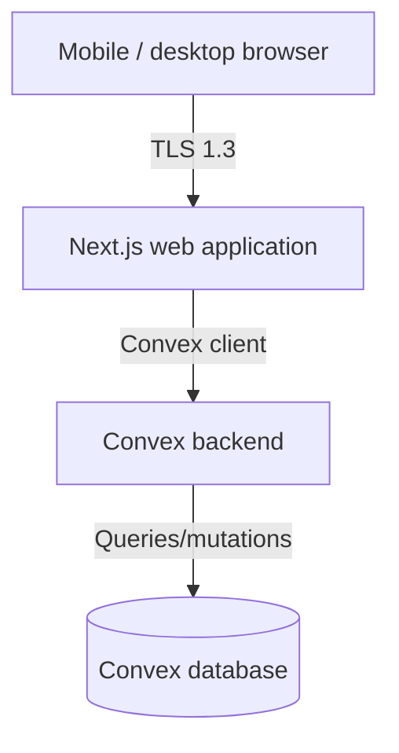

# Chama Platform — Foundation Architecture (Phase 1)

**Status:** Design baseline; not a production-readiness declaration.
**System name:** `Chama Platform` is an installation default only. The displayed name is read from the singleton `SystemConfiguration` record after bootstrap; only the OWNER can change it through a step-up-authenticated workflow.

## 1. Architecture diagram



### Trust boundaries

1. **Browser → application:** all client input is hostile; frontend controls are only usability aids.
2. **Application → database:** least-privileged database users; service methods scope every group-owned query.
3. **Application → storage/provider:** private buckets and adapter interfaces; no credentials in client code.
4. **Operational plane:** migration, app, report and audit roles are distinct; production secrets come from KMS/secrets manager.

## 2. Deployment architecture

- CDN/WAF and managed load balancer terminate TLS and enforce an origin allowlist and request-size limits.
- Next.js runs as a stateless web application. Convex handles authentication, data access, and reactive queries.
- Convex provides managed database storage with encrypted data at rest and automatic backups.
- S3-compatible storage is private. The web application authorizes a request before issuing a short-lived signed URL or streaming a file.
- Managed ingress forwards only `/` and Convex endpoints; it sends HSTS, CSP, Referrer-Policy, frame-ancestors and related security headers.

## 3. Project structure

```text
chama-platform/
├─ apps/
│  └─ web/                 # Next.js / TypeScript, accessible responsive UI
├─ convex/                 # Convex schema, functions, and auth
├─ docs/                   # architecture, threat model, operations
└─ .github/workflows/      # CI checks
```

## 4. Authentication design

- Passwords are processed only by Convex functions using **SHA-256** with a salt; plaintext passwords and reset tokens are never persisted or logged.
- There is no public self-registration. The polished **Sign up** route is an **invited-account activation** flow. A Group Admin/Super Admin creates an authorized invitation; the recipient receives a one-time, short-expiry token. This preserves the prompt's "Group Admin creates a member" rule.
- The login endpoint has generic failure messages and immutable login-attempt events.
- Privileged roles must enroll TOTP/WebAuthn MFA before full access. Step-up MFA is required for protected OWNER actions.
- Session tokens are opaque random strings. They are short-lived and revocable server-side. CSRF tokens protect cookie-authenticated mutations.
- Password reset uses a random, hashed, single-use, short-lived token and revokes sessions after completion.

## 5. Authorization design

Deny by default. Convex functions authenticate, resolve roles, then enforce authorization before any query/action. Client-supplied IDs are never trusted for authorization.

- A **Member** may access only their own member profile/resources and their authorized member↔Group Admin conversations.
- A **Group Admin** can access a record only if its `groupId` is in the admin's active assignment set.
- An **Admin** is explicitly read-only; router and service policies reject mutations.
- A **Super Admin** must have an explicit group grant; it is not an automatic global member-data bypass.
- The **Owner** has the few global policies specified, with step-up controls for high risk actions.
- Files, REST requests, report exports and WebSocket room joins run the same ownership/group checks. UUIDs are opaque identifiers, not authorization.

## 6. Encryption and key management

- TLS 1.2 minimum; TLS 1.3 preferred; HSTS in production.
- Database, backups, object storage and audit archive encrypted at rest by infrastructure controls. Selected high-sensitivity fields can use envelope encryption with a KMS-managed data-encryption key.
- Keys, provider secrets, database credentials and JWT/session signing material are external secrets, separated by environment, rotated and never committed. `.env.example` contains names only.
- Private chat is TLS-protected and encrypted at rest. It is **not labelled E2EE** unless a separately reviewed, standards-based protocol and key lifecycle are delivered.

## 7. Audit design

Every security, administrative, export, document, auth and financial action writes an append-only `AuditLog`. The payload excludes secrets, password hashes and raw tokens. Events include actor, actor role snapshot, target type/id, action, outcome, request ID, timestamp, minimal source metadata and safe before/after summary.

Each audit event stores `previousHash` and `entryHash` (hash chaining), and is shipped to a restricted immutable/WORM-capable destination. UI users, including Owner, can review but cannot silently edit or delete events. Financial records are corrected by linked compensating/reversal entries, never an in-place historical overwrite.

## 8. Financial ledger design

Money is stored in **integer Kenyan shillings** in Convex. It is rendered as KES but never calculated by JS floating point. Registration fees, savings, cash loans, fines and item loans use separate accounts/categories.

- Every posted event produces immutable `FinancialLedgerEntry` records with idempotency keys.
- `SavingsTransaction` has a unique `(savingsAccountId, contributionWeek)` to prevent duplicate weekly contribution cycles.
- A cash-loan creation transaction locks the savings account and current active-loan set, recomputes eligible savings server-side, limits principal to 50%, then records the loan and ledger entries atomically.
- Overdue work uses a deterministic `(cashLoanId, fineRuleVersion)` uniqueness constraint. Fine = 1% of outstanding principal after 14 days, stored as a separate fine and ledger category.
- A clearance records payment and verification actor/timestamp; it cannot be inferred from UI state.

## 9. Backup and recovery design

- Convex provides managed backups and point-in-time recovery.
- Object-store versioning plus encrypted off-site replication; audit archive retention under a separate policy.
- Jobs record backup/restore evidence, but UI may only show a verified backup status when the backup integration reports it.
- Initial operational target for review: RPO ≤ 15 minutes and RTO ≤ 4 hours. Final targets must be agreed with the operator and tested, not merely documented.

## 10. CI/CD architecture

Pull request pipeline: format/lint → TypeScript unit tests → Convex schema validation → integration/authorization/concurrency tests → SAST → dependency, secret and container scanning → build. Staging deploy uses isolated credentials/database. Production deploy requires protected approval, migration backup/check, health checks, rollback plan and post-deploy monitoring. No fixture or test credential crosses an environment boundary.

## 11. Migration plan

1. Bootstrap global configuration, users, invitations, sessions, MFA, login/audit/security events in Convex.
2. Add groups, explicit staff group assignments, members and uniqueness/capacity constraints.
3. Add immutable financial accounts/transactions/loans/items with indexes and idempotency constraints.
4. Add private files, agreements/document versions/signatures, reports and notifications.
5. Add chats and authorization policies after integration tests exist.
6. Add data-retention metadata/archival jobs and performance indexes where safe.

## 12. Kenyan privacy and compliance considerations

The system is designed around data minimization, lawful/fair/transparent processing, purpose limitation, security safeguards, retention and data-subject workflows aligned with Kenya’s Data Protection Act, 2019 and ODPC materials. It should maintain privacy notices, processing records where applicable, correction/export workflows, configurable retention and secure deletion/anonymization processes. Collect national identifiers, contact data, photos and emergency contacts only when documented as necessary.

A Community Group constitution and financial-record retention should be configurable, versioned and reviewed. The Community Groups Registration Act and group-specific obligations must be assessed; financial records may require multi-year retention. Regulated lending, deposits, payment/mobile-money integrations or other financial services require Kenyan legal/compliance advice to determine licensing and reporting obligations. This document is architecture guidance, not legal advice.

## 13. Incremental delivery boundary

This repository establishes architecture, schema, secure auth/API foundations and the sign-in/sign-up UX. It does **not** claim that external providers, backup execution, KMS, SMS/email, malware scanning, production TLS or an E2EE protocol are configured. They must fail closed/clearly until real infrastructure credentials and contracts are supplied.
