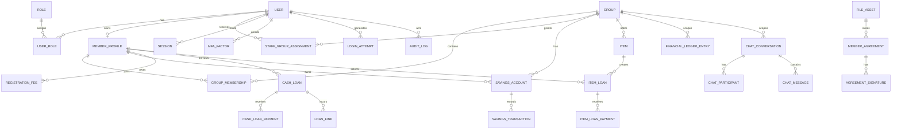

# Data Model, Migration Notes and Security Test Plan

## Entity relationship diagram

## Key constraints and indexes

- UUID IDs; foreign keys and timestamps on all domain records.
- `User.email` and normalized `MemberProfile.phoneE164` unique when present. No stored plaintext passwords.
- `GroupMembership` unique active membership per `(groupId, memberProfileId)`; a transaction/trigger or lock enforces max 30 active members and state transitions.
- Separate `RegistrationFee`, `SavingsAccount`, `CashLoan`, `LoanFine`, `ItemLoan` and their ledger entries guarantee category separation.
- `SavingsTransaction(savingsAccountId, contributionWeek)` unique to prevent duplicate weekly contributions.
- `LoanFine(cashLoanId, ruleVersion)` unique for idempotent overdue jobs; `FinancialLedgerEntry.idempotencyKey` unique.
- Query indexes include group/status/date, member/status/date, loan due dates, conversation/message date and audit time/action.
- Agreements and reports are versioned records that reference private immutable objects and content hashes.

## Automated security test plan

| Test | Expected proof |
|---|---|
| Member A reads Member B savings/loan/profile/PDF | API and file layer deny without data leakage |
| Group Admin A reads Group B resource | explicit group assignment query blocks it |
| ADMIN posts a savings or loan approval | 403 from route/service and no ledger mutation |
| SUPER ADMIN creates SUPER ADMIN or OWNER | denied; Owner-only cardinality workflow enforced |
| GROUP ADMIN creates SUPER ADMIN | denied |
| MEMBER accesses admin/system endpoint | denied |
| OWNER authorized global action | allowed only after required step-up action |
| Two concurrent cash-loan requests | combined principal cannot exceed 50% eligible savings |
| Duplicate overdue job | only one fine and one fine ledger entry |
| Four failed logins | security event and Owner alert recorded; lock/rate limit applied |
| Logs/search | no hashes, passwords, reset/session tokens |
| Revoked session cookie/socket | cannot reuse route or WebSocket connection |
| Unauthorized conversation subscription | rejected before room join |
| Unauthorized CSV/report export | denied and logged |
| Upload spoof / oversized image | rejected; valid image re-encoded and private |
| CSRF, XSS, SQLi, SSRF, path traversal | denied/sanitized with no internal disclosure |

## Financial integrity fixtures

- `Savings 100000 → maximum cash loan 50000`
- `Savings 50000 → maximum cash loan 25000`
- `Cash loan outstanding 20000 after 14 days → fine 200`
- `Registration fee default 200`
- Tests assert ledger category separation: registration fee ≠ savings ≠ cash loan ≠ fine ≠ item loan.

## Test layers

1. Unit: money operations using `BigInt`, password/session helpers, policy decisions.
2. Integration: PostgreSQL migrations, constraints, RLS, Fastify handlers and worker idempotency.
3. End-to-end: invitation activation, MFA, group lifecycle, private file access and reports.
4. Security: OWASP-oriented SAST, DAST/pentest, dependency/secret/container scans, rate-limit/session/WebSocket and BOLA regression tests.
5. Operational: backup restore rehearsal, alert delivery, load test, migration rehearsal and incident runbook exercise.
